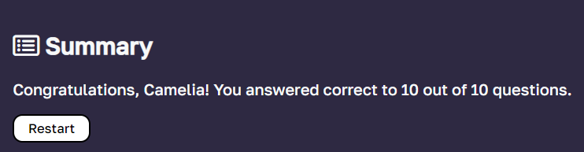

# Countries of Europe

**Countries of Europe** is a quiz where a user can test his knowledge about Europe's countries and their interesting facts that make them unique. The quiz will be targeted toward people who not only love geography but also love to learn everything about Europe's countries. Countries of Europe is a fully responsive JavaScript quiz game that will allow users to test their geography knowledge and to learn using photographs from around Europe.

## Features
### *Existing Features*
**The Countries of Europe Logo and Heading**

Featured at the top of the page, the Countries of Europe logo and heading is easy to see for the user. Upon viewing the page, the user will be able to see the name of the quiz.

### **The Game Section**

This section will allow the user to register his name and to start the quiz. This area will hide after the user is clicking "Let's get Started!" and the quiz area will appear which will allow the user to play the questions. 

### **The Question Section**

The question section is where the user will be able to see the question to answer as part of the quiz. The user will be able to easily see the questions, the answers and the image which reflects the correct answer.
The user will be able to select the correct answer by clicking on the different buttons.

### **The Summary Section**

This section will allow the user to see exactly how many correct answers they have provided.

### **The Contact Section**
The contact section encourages users to get in contact and provides a phone number, email address and street address where the company can be found.

The contact section includes social media icons so users can find the company on facebook, twitter, youtube and instagram. The contact section is valuable to the user as it gives them the ability to find and contact the company who made the quiz if they need to.

### *Features left to Implement*
- a table with previous users who played the quiz and their score

## Testing
### Validator Testing
- HTML
No errors were returned when passing through the official W3C validator
- CSS
No errors were found when passing through the official (Jigsaw) validator
- JavaScript
No errors were found when passing through the official Jshint validator
    - The following metrics were returned:
There are 11 functions in this file.
Function with the largest signature takes 2 arguments, while the median is 0.
Largest function has 10 statements in it, while the median is 3.
The most complex function has a cyclomatic complexity value of 4 while the median is 2.

## Accesibility

I confirmed that the colors and fonts chosen are easy to read and accessible by running it through lighthouse in devtools.

Lighthouse Score for Desktop size

Lighthouse Score for Mobile size

## Unfixed Bugs
No unfixed Bugs.

## Deployment
The site was deployed to GitHub pages. The steps to deploy are as follows:
1. In the GitHub repository, navigate to the Settings tab.
2. Navigate to the Pages section.
3. From the Build and Deployment section, select the Main Branch as the source.
4. Deployment workflow should start.

The live link can be found here - https://camelia03.github.io/portofolio-project-2/

## Credits

### Content
- The questions were inspired by the following website: [Trafalgar.com](https://www.trafalgar.com/real-word/21-facts-europe-never-knew/)
- The icons were taken from [Font Awesome](https://fontawesome.com/).
### Media
- The photo used on the background of the quiz is from [Unsplash](https://unsplash.com/).
- The images used for the questions 1, 2, 3 were taken from [Unsplash](https://unsplash.com/).
- The images used for questions 4 to 10 were taken from [Pixabay](https://pixabay.com/).

